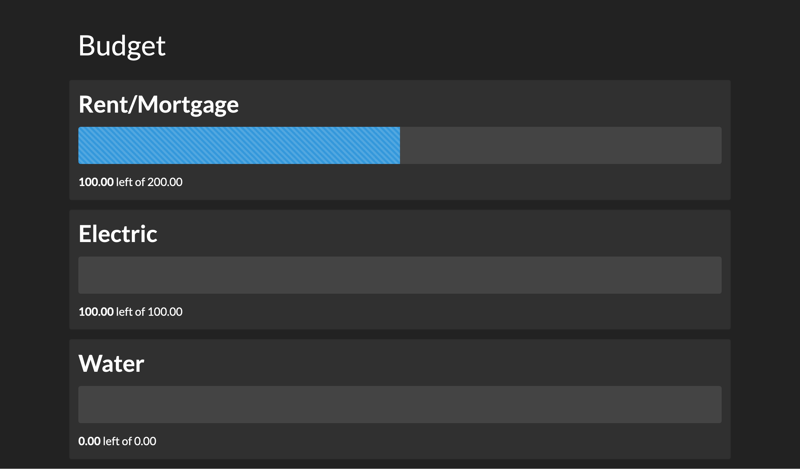

# YNAB Dashboard

A simple dashboard for showing your [YNAB](https://youneedabudget.com) budget.



[](https://heroku.com/deploy?template=https://github.com/bitboxer/ynab-dashboard)

# Starting

```bash
yarn install
YNAB_ACCESS_TOKEN=token yarn start
```

The token can be generated on [the developer settings page](https://app.youneedabudget.com/settings/developer).

After that you can open a webbrowser to see your budget:

`http://localhost:4000/BUDGETID`

BudgetID is the UUID of the budget you want to see. You can find it with looking at the URL of the
YNAB web site: `https://app.youneedabudget.com/BUDGETID/...`. 

Additionally you can filter and only show selected budgets like this:

`http://localhost:4000/BUDGETID?category=Food&category=Cats`

This code is inspired by [ynab-dashboard](https://github.com/computerwizjared/ynab-dashboard) by [Jared Bates](https://github.com/computerwizjared).
